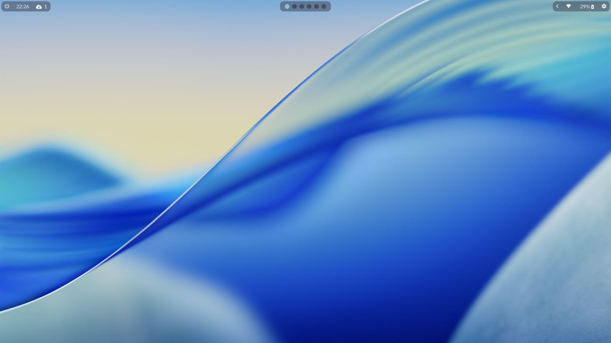
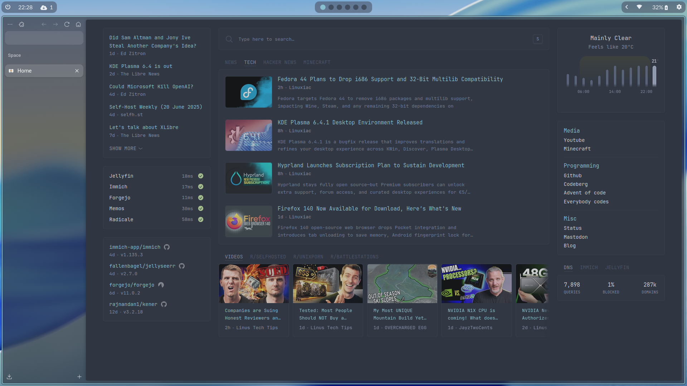
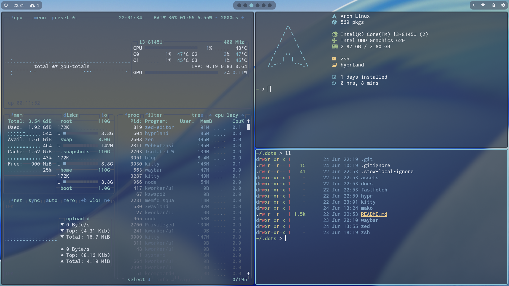
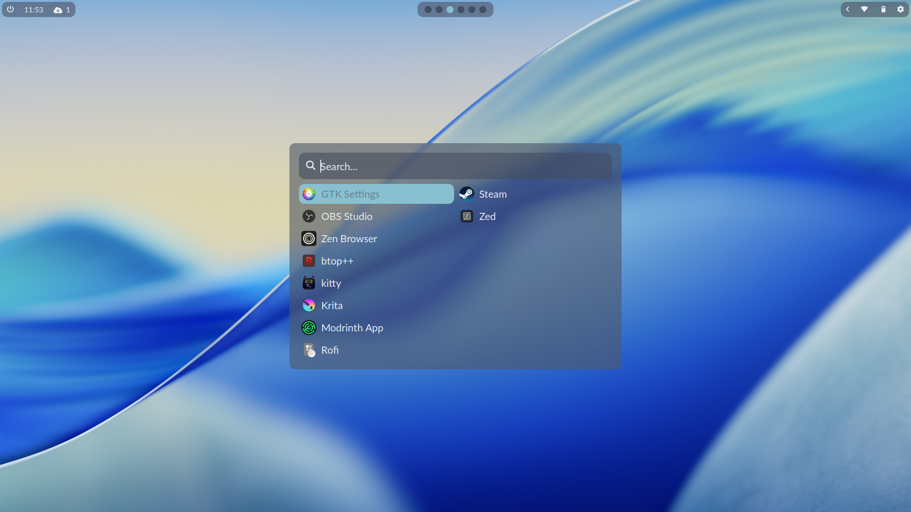

# Dotfiles
test
These are the dotfiles I'm currently using on my computer. They're linked with `stow` and are updated when I reconfigure them. Things can break, so beware. These are mostly for my own use and not particularly made to be used by others.

## Screenshots

 &nbsp; 

 &nbsp; 

## Information

This rice is based around Hyprland, a wayland compositor. It is made to my preferences and managed through git and stow. This is a short list of the programs used in this rice and some general information:

- [hyprland](https://hypr.land), used as a compositor.
- [hyprpaper](https://wiki.hypr.land/Hypr-Ecosystem/hyprpaper/), the wallpaper daemon, doesn't have a config file in this git repo.
- [mako](https://github.com/emersion/mako), the notification daemon
- [pipewire](https://pipewire.org), sound daemon used with `wireplumber` to change volume
- [waybar](https://github.com/Alexays/Waybar), bar with config inspired by [elifouts' dots](https://github.com/elifouts/Dotfiles)
- [rofi](https://davatorium.github.io/rofi/), the application launcher with slightly adjusted [adi1090x config](https://github.com/adi1090x/rofi)
- [kitty](https://sw.kovidgoyal.net/kitty), terminal emulator
- [zed](https://zed.dev), main editor with some small tweaks

### CLI

- [zsh](https://zsh.org), main shell
- [fastfetch](https://github.com/fastfetch-cli/fastfetch), fetch that runs on startup, heavily customized with custom lifetime script
- [imv](https://sr.ht/~exec64/imv), simple cli-based image viewer
- [eza](https://https://eza.rocks), better nicer-looking ls clone
- [yazi](https://yazi-rs.github.io), a fast, good-looking terminal file manager
