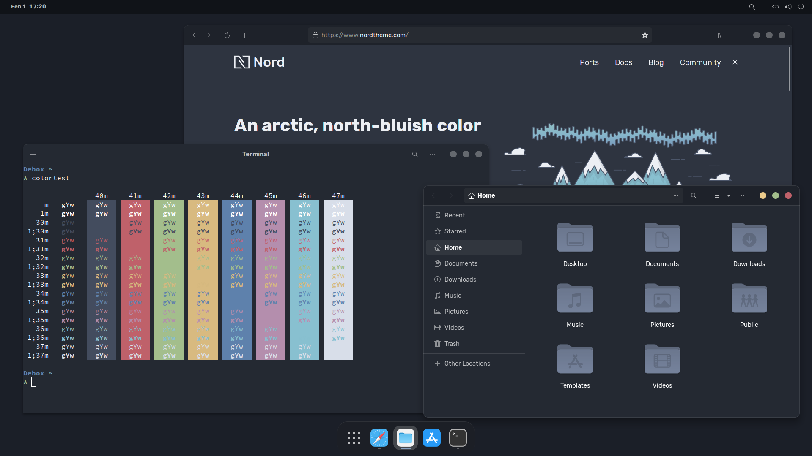

<h1 align = "center">Gnome Nord</h1>

This is a [Nord](https://nordtheme.com) themed rice using the Gnome desktop environment using zsh and mostly normal Gnome apps further.

## Screenshots


## Installation
A few things need to be installed by the user and aren't available in this repo. I'll go over those first

### Extensions
The following extensions have to be installed:
- [User Themes](https://extensions.gnome.org/extension/19/user-themes/)
- [Just Perfection](https://extensions.gnome.org/extension/3843/just-perfection/)
- [Search Light](https://extensions.gnome.org/extension/5489/search-light/)
- [Blur my Shell](https://extensions.gnome.org/extension/3193/blur-my-shell/)
- [Dash to Dock](https://extensions.gnome.org/extension/307/dash-to-dock/)
- [Compact Quick Settings](https://extensions.gnome.org/extension/5527/compact-quick-settings/)

> Settings will be added soon

### Theming
The gtk and shell theme that is used is vinceliuice's [Colloid theme](https://github.com/vinceliuice/Colloid-gtk-theme) and matching [Colloid icons](https://github.com/vinceliuice/Colloid-icon-theme). Install them as following:
clone both repos into the downloads folder using `git clone <link here>`. Install icon and shell theme with the following commands:

Icons:
```
$ cd Colloid-icon-theme

$ ./install.sh -s nord -t grey
```
Theme:
```
$ cd Colloid-gtk-theme

$ ./install.sh -l -c dark --tweaks nord rimless
```
The cursor pack used is [Bibata Modern Classic](https://www.gnome-look.org/p/1914825/), download the file from here and unpack it into `.local/share/icons`.

After installation, you can add the icon, cursors and gtk theme to your apps with the Gnome Tweaks tool. Go to the 'appearance' tab and select the right themes for icons, cursors, themes and legacy applications

### Fonts
The fonts used in this rice are [Rubik](https://fonts.google.com/specimen/Rubik) and [Source Code Pro](https://fonts.google.com/specimen/Source+Code+Pro). Choose the fonts in the Gnome Tweaks tool again, use Rubik regular 11 for interface and document text, and Rubik Semibold 11 for legacy window titles. Source Code Pro Regular 10 is used for monospace text.

### Terminal
The terminal is just Gnome terminal with zsh as shell. To install zsh use your distributions package manager to install the `zsh` package. For example, on Debian/Ubuntu it would be `sudo apt install zsh`. After this, copy the `.zshrc` to your home directory. Enable zsh in the command tab in 'run a custom command' and enter `zsh` in the textbox.

For theming, change the colors to:
- black: `#434C5E`
- red: `#BF616A`
- green: `#A3BE8C`
- yellow: `#D8BA80`
- blue: `#5E81AC`
- purple: `#B48EAD`
- cyan: `#88C0D0`
- white: `#D8DEE9`

To make the terminal a bit more clean, remove the scrollbar.

To use some of the aliases from the `.zshrc`, install `exa` and `starship`. Exa can be installed using your distros pacakge manager, but starship requires to be downloaded from their site. Install starship like this (replace apt with the package manager of your distro):
```
$ sudo apt install curl

$ curl -sS https://starship.rs/install.sh | sh
```
After this, add the `starship.toml` file to your `.config` directory.
